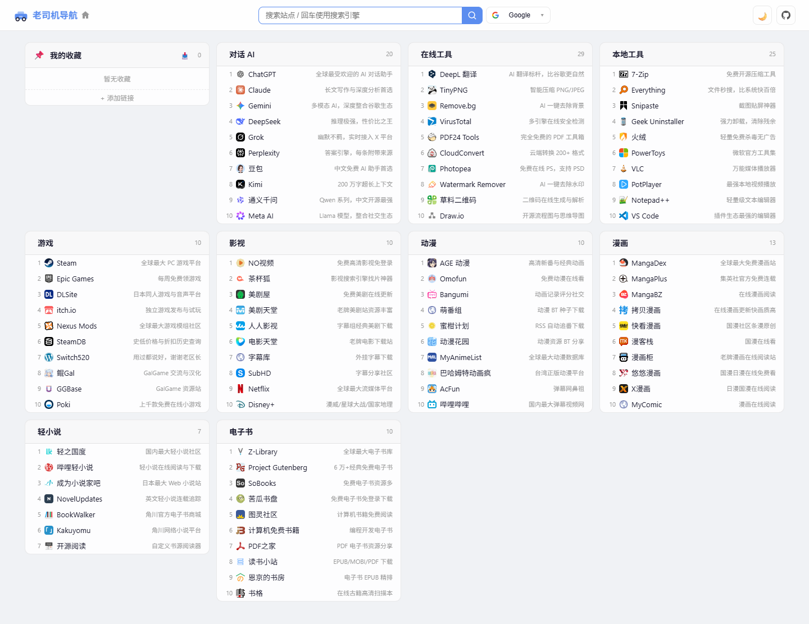

# 🚗 老司机导航

> 开箱即用的极简美观导航网站，支持自定义收藏和导入导出

[](https://opensource.org/licenses/MIT) 



## 特性

- 🔍 **一框两用** — 输入实时搜索站内所有链接的标题和描述；回车跳转搜索引擎
- 🔄 **多引擎切换** — 搜索框旁可切换 Google/必应/B站/知乎等 11 个搜索引擎
- 📦 **零依赖零构建** — 纯静态页面，无需安装任何工具，浏览器直接打开即可使用
- 📌 **自定义链接** — 添加/编辑/删除个人收藏，支持导入/导出，存储于浏览器本地
- 🌓 **深色模式** — 跟随系统或手动切换，偏好自动保存
- 📱 **响应式布局** — 桌面 4 列到手机单列，自动适配各种屏幕
- ✅ **默认 SFW** — 日常内容安全，`?mode=nsfw` 可解锁额外分类
## 本地运行

直接浏览器打开 `index.html`，或用任意静态服务器：

```bash
npx serve .
```

在线访问：<https://navi.old-driver.com>

## 本地开发

项目是纯静态页面，无需构建工具，修改代码后刷新浏览器即可预览。

### 项目结构

```
index.html
assets/
  css/style.css               # 全部样式，CSS 变量支持深浅主题
  js/
    data/init.js               # NAV_DATA = { categories: [] }
    data/{ai,tools,...}.js     # 各自 push 到 NAV_DATA.categories
    utils/theme.js             # 主题切换与持久化
    utils/storage.js           # localStorage 封装
    components/header.js       # 顶栏、搜索、搜索引擎选择
    components/linkCard.js     # 链接条目渲染与自定义链接操作
    components/category.js     # 分类卡片渲染
    app.js                     # App.init() 入口
```

### 添加分类

在 `assets/js/data/` 下新建 `.js` 文件：

```js
NAV_DATA.categories.push({
  id: "my-category",
  name: "我的分类",
  icon: "🌟",
  links: [
    { title: "示例站点", url: "https://example.com", desc: "描述文字（可选）", icon: "" }
  ]
});
```

然后在 `index.html` 的 `<body>` 中按顺序添加对应的 `<script>` 标签。

所有用户数据存储在 `localStorage`，key 统一以 `navi-` 为前缀。

## 贡献

欢迎提交 Issue 和 Pull Request！

1. Fork 本项目
2. 创建你的特性分支 (`git checkout -b feature/AmazingFeature`)
3. 提交你的修改 (`git commit -m 'Add some AmazingFeature'`)
4. 推送到分支 (`git push origin feature/AmazingFeature`)
5. 打开一个 Pull Request

---

如果这个项目对你有帮助，欢迎给它个 ⭐ ！
